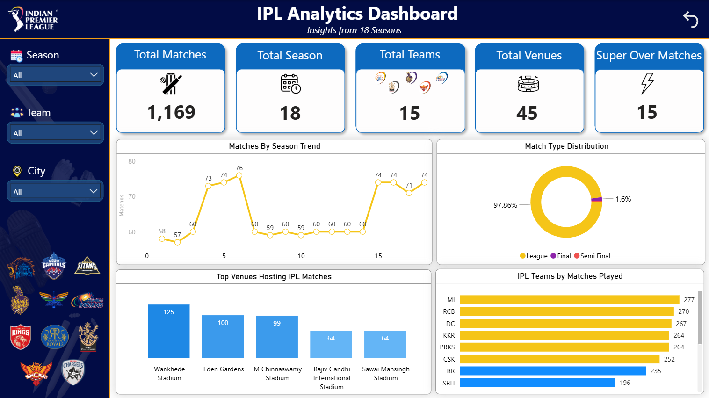
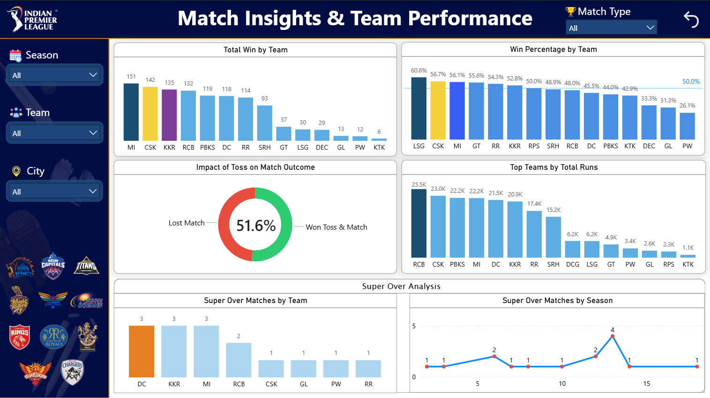

# 🏏 IPL Analytics Dashboard (Power BI)

## 📌 Overview
This project is an interactive IPL Analytics Dashboard built using Power BI. It provides insights from 18 seasons of IPL data, including team performance, match trends, venues, and match types.

The dashboard helps users explore IPL data easily using slicers and visualizations.

---

## 🚀 Features

- 📊 Total Matches, Seasons, Teams, Venues, Super Over stats  
- 📈 Matches trend across seasons  
- 🥧 Match type distribution (League, Final, Qualifier, etc.)  
- 🏟️ Top venues hosting IPL matches  
- 🏏 Team performance analysis  
- 📉 Win percentage comparison  
- 🎯 Toss impact on match outcome  
- ⚡ Super Over analysis  

---

## 📂 Dashboard Pages

### 🔹 1. IPL Overview Dashboard
- High-level summary of IPL data  
- Season-wise match trend  
- Match type distribution  
- Top venues and teams  

### 🔹 2. Match Insights & Team Performance
- Total wins by teams  
- Win percentage analysis  
- Toss impact visualization  
- Top teams by total runs  
- Super Over insights  

---

## 🛠️ Tools & Technologies

- Power BI  
- Power Query (Data Cleaning)  
- DAX (Data Analysis Expressions)  

---

## 📊 Dataset

- IPL dataset (2008–2025)  
- Includes:
  - Teams  
  - Venues  
  - Match type  
  - Season  
  - Results  

---

## 🎯 Key Insights

- Most matches are League matches (~97%)  
- Toss has minimal impact (~51% win after toss)  
- Some teams dominate in total wins  
- Certain venues host more matches  
- Super Over matches are rare  

---

## 📸 Screenshots

---

## 💡 Use Case

- Data Analyst portfolio project  
- Power BI practice  
- Sports analytics  
- Interview showcase  

---

## 👨‍💻 Author

**Ravsaheb Bansode**  
Aspiring Data Analyst  

---

## ⭐ Support

If you like this project, give it a ⭐ on GitHub!
